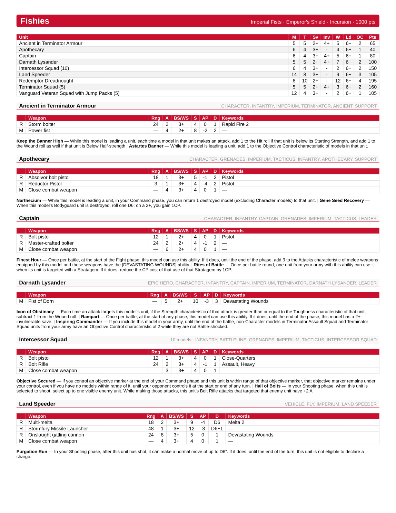

# 40k Roster PDF

Turn a **[New Recruit](https://newrecruit.eu)** roster export into a clean, printable
Warhammer 40,000 quick-reference PDF — stats, weapons, abilities, enhancements, and
army rules for your whole list on a page or two.

**▶ Live app: https://jinxidoru.github.io/40k-roster-pdf/** — drop your roster, get a PDF.
Everything runs in your browser; nothing is uploaded.



## How to use

1. In New Recruit, build your list and **Export → BattleScribe / JSON**.
2. Open the [live app](https://jinxidoru.github.io/40k-roster-pdf/), drop the `.json` in, and click **Generate PDF**.

The roster export already contains everything (exact loadouts, points, abilities), so
it works for **any faction** with no extra data to download. The header is colored to
match the faction.

## Rendering styles

Sheets are produced by named *renderers*, each with its own layout (and, later, its own
options). Today:

- **Compact** — the whole army as dense reference tables on US Letter.

More styles (cards, A4, …) can be added without touching the rest.

## Command line

The same renderers run from a CLI (needs [Typst](https://typst.app) installed —
`brew install typst`):

```sh
node scripts/build.js path/to/roster.json            # -> build/<name>.pdf (opens it)
node scripts/build.js roster.json --renderer compact --typ-only --no-open
```

## Notes & limitations

- Detachment-rule and stratagem *text* aren't included in roster exports, so those
  sections are omitted (the army rule, e.g. Oath of Moment, is included).
- Not affiliated with Games Workshop or New Recruit. Game data is © Games Workshop.

## License

MIT (tool code).
